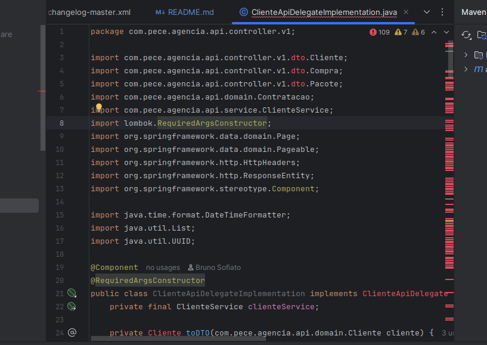

# Plataforma Agência - Tecnicas Projeto Software

Este repositório contém a aplicação API da plataforma de agência, juntamente com arquivos de suporte para execução local via Docker Compose, mocks e configurações do Keycloak.

## Estrutura de Diretórios do Projeto

Abaixo está a estrutura principal de diretórios do projeto, apresentada em formato de árvore ASCII. Os diretórios mais relevantes para desenvolvimento, configuração e execução estão destacados. O local onde ficam as migrações do Liquibase também está indicado.

```
.
├── README.md                  # Documentação principal do projeto
├── pom.xml                    # Configuração do build Maven
├── mvnw / mvnw.cmd            # Maven Wrapper (scripts)
├── CHANGELOG.md               # Histórico de mudanças e versões
├── docs/                      # Documentação adicional (guias, requisitos)
├── other/                     # Arquivos auxiliares (docker, mocks, keycloak, postman)
│   ├── codemetrics4j/         # Scripts e Dockerfile para geração de métricas
│   ├── docker-compose/        # Compose para orquestrar serviços locais
│   ├── keycloak/              # Realm e usuários do Keycloak (import/export)
│   ├── mock-server/           # Mocks do WireMock (hotéis, locadora, etc.)
│   ├── nginx/                 # Configuração do proxy reverso
│   └── postman/               # Coleção e ambiente para testes de API
├── src/                       # Código-fonte e recursos da aplicação
│   ├── main/
│   │   ├── java/              # Código-fonte principal (controllers, services, domain, etc)
│   │   └── resources/         # Configurações e recursos (application.yaml, i18n, etc)
│   │       ├── application.yaml
│   │       └── swagger/
│   │           └── v1.yaml    # Especificação OpenAPI/Swagger da V1 das APIs
│   │       ├── ...
│   │       └── db/
│   │           └── changelog/ # Migrações do Liquibase (ex.: db.changelog-master.yaml)
│   └── test/
│       ├── java/              # Testes automatizados
│       └── resources/         # Recursos usados pelos testes
```

## Estrutura de Pacotes Java

Abaixo está a estrutura principal de pacotes do código-fonte Java, localizada em `src/main/java/com/pece/agencia/api`. Os pacotes seguem a organização recomendada para projetos Spring Boot, separando responsabilidades por camada e incluindo subpacotes relevantes.

```
com.pece.agencia.api
├── config           # Configurações globais (OpenAPI, segurança, Stripe, web)
├── controller       # Controllers REST (endpoints da API)
│   └── v1           # Endpoints versão 1 da API
│       └── mapper   # Conversão e mapeamento de dados entre camadas
├── domain           # Entidades de negócio e modelos de dados
├── repository       # Interfaces de acesso a dados (Spring Data JPA)
├── service          # Serviços e lógica de negócio
```

> **Observação:** Novos pacotes e subpacotes podem ser adicionados conforme o projeto evolui.

## Pré-requisitos

Antes de rodar a aplicação, instale as ferramentas abaixo:

### Java 21 (JDK 21)

- A versão alvo do projeto é Java 21 conforme `pom.xml` (<java.version>21</java.version>).
- Download/instalação: https://adoptium.net/ (ou https://jdk.java.net/21/)

### Maven Wrapper (já incluso no projeto)

- Use `./mvnw` para builds portáveis sem precisar instalar Maven globalmente.

### Docker Engine

- Docker Engine (Docker CE/EE) é necessário para construir e executar containers.
- Página oficial e downloads: https://docs.docker.com/get-docker/
- Verifique a instalação com:

```bash
docker --version
```

### Docker Compose (v2)

- Este projeto usa a sintaxe do Docker Compose v2 (comando `docker compose ...`). Instale a versão recomendada nas páginas oficiais ou use o Docker Desktop que inclui o Compose.
- Documentação: https://docs.docker.com/compose/
- Verifique a instalação com:

```bash
docker compose version
```

> **Observação:** em muitas distribuições o comando legado `docker-compose` (com hífen) pode existir, mas as instruções deste README usam `docker compose` (sem hífen), que faz parte do plugin Compose V2.

## Docker Compose
Docker Compose é uma ferramenta para definir e executar aplicações multi-container Docker usando arquivos YAML. Neste projeto há um arquivo de compose que descreve os serviços necessários para rodar a API e ambientes de suporte.

Arquivo de compose: `other/docker-compose/compose.yaml`

### Serviços descritos no Docker Compose
O `compose.yaml` inclui os seguintes serviços (cada serviço abaixo tem sua própria subseção):

#### mysql
- Imagem: `mysql:8.0`
- Função: banco de dados usado por Keycloak e pela aplicação.
- Documentação: https://hub.docker.com/_/mysql

#### stripe-mock
- Imagem: `stripe/stripe-mock`
- Função: mock do serviço Stripe para testes de integração de pagamentos.
- Repositório: https://github.com/stripe/stripe-mock

#### mocks (WireMock)
- Imagem: `wiremock/wiremock`
- Função: simula APIs externas (hotéis, voos, locadora).
- Mapas de endpoints: `other/mock-server/*.json`
- Documentação: http://wiremock.org
- Observação: este serviço utiliza um init container (`wiremock-extensions-download`) para baixar extensões WireMock antes da inicialização, permitindo suporte a funcionalidades customizadas.

#### wiremock-extensions-download
- Imagem: `debian:stable-slim`
- Função: init container responsável por baixar extensões customizadas do WireMock antes do serviço principal iniciar. Os arquivos baixados são montados em volume compartilhado e utilizados pelo container do WireMock.

#### api
- Imagem: `com.pece.agencia.v2/api:latest`
- Função: a aplicação Spring Boot deste repositório.
- Observação: este serviço pertence ao profile `hosting-api` (use `--profile hosting-api` para incluí-lo no compose).

#### nginx
- Imagem: `nginx:latest`
- Função: proxy reverso que expõe a `api` na porta 8080 conforme `other/nginx/default.conf`.
- Observação: este serviço pertence ao profile `hosting-api`.

#### spring-boot-admin
- Imagem: `codecentric/spring-boot-admin`
- Função: dashboard para monitoramento das instâncias Spring Boot.
- Documentação: https://codecentric.github.io/spring-boot-admin/current/

#### keycloak
- Imagem: `quay.io/keycloak/keycloak:26.3.3`
- Função: provedor de identidade e autorização (OpenID Connect / OAuth2).
- Realm: o realm `pece` é importado a partir de `other/keycloak`.
- Documentação: https://www.keycloak.org/

#### keycloak-export
- Imagem: mesma do `keycloak` acima
- Função: contêiner usado apenas para exportar o realm `pece` para disco.
- Observação: este serviço pertence ao profile `realm-export`.

#### generate-metrics
- Build: constrói a partir do diretório `../codemetrics4j` (Dockerfile próprio)
- Função: executa análise de métricas de código-fonte Java, gerando relatórios na pasta `target/metrics/`.
- Volumes:
	- `../../src/main/java/` montado como `/app/input` (somente leitura)
	- `../../target/metrics/` montado como `/app/output` (escrita dos relatórios)
- Observação: este serviço pertence ao profile `generate-metrics` e não é iniciado por padrão.


### Executando com Docker Compose
O arquivo de compose está em `other/docker-compose/compose.yaml`.

#### Iniciar todos os serviços (perfil padrão)

Perfil padrão (sem usar `--profile`): este compose sobe apenas as dependências necessárias (por exemplo: `mysql`, `keycloak`, `mocks`, `stripe-mock`, `spring-boot-admin`) para permitir que o módulo `api` seja executado localmente a partir de uma IDE. Use este modo quando estiver desenvolvendo e rodando o código da API na sua máquina (IDE).

```bash
docker compose -f other/docker-compose/compose.yaml up
```

#### Iniciar apenas serviços do perfil `hosting-api` (API + nginx e dependências)

Perfil `hosting-api`: sobe as dependências e também a imagem `com.pece.agencia.v2/api:latest` (ou a imagem local gerada). Use `--profile hosting-api` quando quiser executar a API via container (em vez de rodá-la na IDE) junto com o `nginx` e os serviços relacionados.

```bash
docker compose -f other/docker-compose/compose.yaml --profile hosting-api up --build
```

#### Exportar realm Keycloak (profile `realm-export`)

Perfil `realm-export`: executa o serviço `keycloak-export` para exportar o realm `pece` para a pasta `other/keycloak`.

```bash
docker compose -f other/docker-compose/compose.yaml --profile realm-export up keycloak-export
```

#### Gerar métricas de código (profile `generate-metrics`)

Perfil `generate-metrics`: executa o serviço `generate-metrics` para analisar o código-fonte Java e gerar relatórios de métricas na pasta `target/metrics/`.

```bash
docker compose -f other/docker-compose/compose.yaml up generate-metrics
```


Os relatórios gerados incluem o arquivo `target/metrics/metrics.html`, que apresenta um relátorio das métricas do projeto:

> **Observação:** Para mais detalhes sobre cada métrica, consulte a documentação oficial do [codemetrics4j](https://github.com/codemetrics4j/codemetrics4j).

#### Encerrar e remover containers/volumes de rede

```bash
docker compose -f other/docker-compose/compose.yaml down --volumes
```


## Chamando as APIs (Postman)

Postman é uma plataforma para desenvolver, testar e documentar APIs. Ela permite organizar requisições em coleções, gerenciar ambientes (variáveis), executar fluxos de teste e obter tokens OAuth2 diretamente pela interface.

Há uma coleção e um ambiente Postman em `other/postman/`:

### Arquivos para importação

- `other/postman/postman-collection.json` — coleção de requisições (localidades, clientes, pacotes, contratação e mocks)
- `other/postman/postman-environment.json` — ambiente com variáveis

### Importando a coleção

1. Abra o Postman.
2. Para importar a coleção e o ambiente você pode arrastar os arquivos para a janela do Postman (drag and drop) ou usar "Import" → "File/Folder/Link" e selecionar os arquivos listados acima.
3. Alternativamente você pode usar a extensão do Postman para VS Code ou importar via URL/Git conforme a documentação.

### Obtenção de token (Keycloak)

1. Abra o Postman e selecione a coleção ou a requisição que precisa de autenticação (a coleção já traz os endpoints pré-configurados).
2. Na aba "Authorization" da requisição, selecione "OAuth 2.0" e clique em "Get New Access Token".
3. Clique em "Request Token" e complete o fluxo de login no Keycloak (insira usuário/senha do realm `pece`).
4. Depois de obter o token, clique em "Use Token" para que o Postman adicione o header `Authorization: Bearer <token>` nas requisições.

### Chamadas de API

Abaixo uma tabela com os usuários definidos em `other/keycloak/pece-users-0.json`. A senha de todos os usuários para testes locais é `x`.

| Usuário | Email | Grupo | Senha |
|---|---|---|---|
| camila.mendes78 | camila.mendes78@br.com | clientes | x |
| fernanda.almeida43 | fernanda.almeida43@site.com | atendentes | x |
| isabela.mendes50 | isabela.mendes50@br.com | administradores | x |
| joão.ferreira | joão.ferreira98@mail.com | clientes | x |
| lucas.lima78 | lucas.lima78@mail.com | clientes | x |
| maria.ferreira1 | maria.ferreira1@site.com | clientes | x |
| pedro.castro72 | pedro.castro72@br.com | atendentes | x |
| pedro.nunes33 | pedro.nunes33@site.com | clientes | x |
| rafael.lopes28 | rafael.lopes28@site.com | administradores | x |

### Tutoriais úteis

- Postman: importar coleções e ambientes: [Importing and exporting data](https://learning.postman.com/docs/getting-started/importing-and-exporting-data/)
- Como usar OAuth2 no Postman: [OAuth 2.0](https://learning.postman.com/docs/sending-requests/authorization/#oauth-20)
- Keycloak docs sobre endpoints OpenID Connect: [Keycloak OpenID Connect docs](https://www.keycloak.org/docs/latest/securing_apps/index.html#_oauth2)

## Documentação da API (Swagger/OpenAPI)

A aplicação expõe automaticamente a documentação interativa dos endpoints REST usando o Swagger UI, via Springdoc OpenAPI.

Após iniciar a aplicação (por exemplo, via IDE ou Docker Compose), acesse no navegador:

- Documentação Swagger UI: [http://localhost:8080/swagger-ui.html](http://localhost:8080/swagger-ui.html) ou [http://localhost:8080/swagger-ui/index.html](http://localhost:8080/swagger-ui/index.html)
- Documento OpenAPI (YAML/JSON): [http://localhost:8080/v3/api-docs](http://localhost:8080/v3/api-docs)

> **Dica:**
> - Se estiver rodando a aplicação atrás do Nginx (via Docker Compose), o endereço permanece o mesmo.
> - Se mudar a porta da aplicação, ajuste a URL conforme necessário.

A interface Swagger UI permite:
- Visualizar todos os endpoints REST disponíveis
- Testar requisições diretamente pelo navegador
- Ver exemplos de payloads e respostas
- Explorar modelos de dados e parâmetros

A documentação é gerada automaticamente a partir dos controllers e modelos do Spring Boot.

## Outras tecnologias e ferramentas usadas

Esta sessão trata de outras tecnologias e ferramentas utilizadas para facilitar o desenvolvimento.

### Testes de Arquitetura com ArchUnit

O projeto utiliza o ArchUnit para garantir que as regras de dependência entre as camadas (controller, service, repository, domain) sejam respeitadas, conforme os princípios da Clean Architecture. Os testes automatizados de arquitetura ajudam a evitar violações estruturais e facilitam a manutenção do código.

Para saber mais sobre o ArchUnit, acesse a [página oficial](https://www.archunit.org/).

### Mapeamento de Objetos com MapStruct

O projeto utiliza o [MapStruct](https://mapstruct.org/) para automatizar o mapeamento entre entidades de domínio e DTOs. O MapStruct é um framework de geração de código que cria implementações de mapeadores em tempo de compilação, garantindo alto desempenho e evitando a necessidade de código boilerplate para conversão de objetos.

Principais vantagens do uso do MapStruct:
- Reduz a quantidade de código manual para conversão entre modelos.
- Garante maior legibilidade e manutenção dos mapeamentos.
- Permite customizações e integrações com o Spring.

> **Nota:** O código fonte dos mapeadores implementados pelo MapStruct é gerado automaticamente em tempo de compilação e pode ser encontrado  [aqui](target/generated-sources/annotations/com/pece/agencia/api/controller/v1/mapper/) após o processo de compilação.

Para saber mais sobre o MapStruct, acesse a [documentação oficial](https://mapstruct.org/documentation/stable/reference/html/).

## Observações finais
- Os arquivos de configuração relevantes estão em `src/main/resources` e em `other/` (mocks, nginx, keycloak, docker-compose).
- Se quiser alterar a porta exposta ou outras variáveis, verifique `other/docker-compose/compose.yaml` e `other/nginx/default.conf`.
- O arquivo [CHANGELOG.md](CHANGELOG.md) contém as informações das coisas que foram alteradas em cada versão (bem como link para cada um dos branches).

## Solução de problemas

Essa sessão contém soluções para alguns problemas comuns que podem ocorrer durante o desenvolvimento ou execução do projeto.

### Falta de classes de DTO na IDE.

As vezes, a IDE pode falhar na hora de reconhecer as classes geradas automaticamente a partir do OpenAPI/Swagger (DTOs). Esse comportamento é exemplificado na Figura abaixo.



Para solucionar esse problema, é necessário primeiro compilar o projeto no terminal. Para isso execute o comando abaixo:

```bash
./mvnw clean compile
```
> **Dica** : Se você não usa o wrapper, substitua `./mvnw` por `mvn`.

Após a execução desse comando, as IDE deverá reconhecer as novas classes.

Caso o problema persista, tente executar o *refresh* do contexto da IDE através do comando *Reload All From Disk* (`CTRL+ALT+Y`).

### Falta de arquivos no classpath durante testes

Se você encontrar erros em testes indicando que arquivos não foram encontrados no classpath (por exemplo: "No file named ... found in classpath"), é provável que os recursos de teste ainda não foram copiados para o classpath de teste (diretório `target/test-classes`). Nesses casos é recomendada a execução de um build via linha de comando para garantir que os recursos e dependências necessários sejam baixados e copiados.

Com o Maven Wrapper (recomendado):

```bash
# compila código de teste e copia recursos de teste para o classpath
./mvnw clean test-compile
```

Ou, se preferir executar somente a fase que gera recursos de teste (sem executar os testes):

```bash
# carrega dependências e executa a fase que copia recursos de teste
./mvnw -DskipTests generate-test-resources
```

> **Dica** : Se você não usa o wrapper, substitua `./mvnw` por `mvn`.
